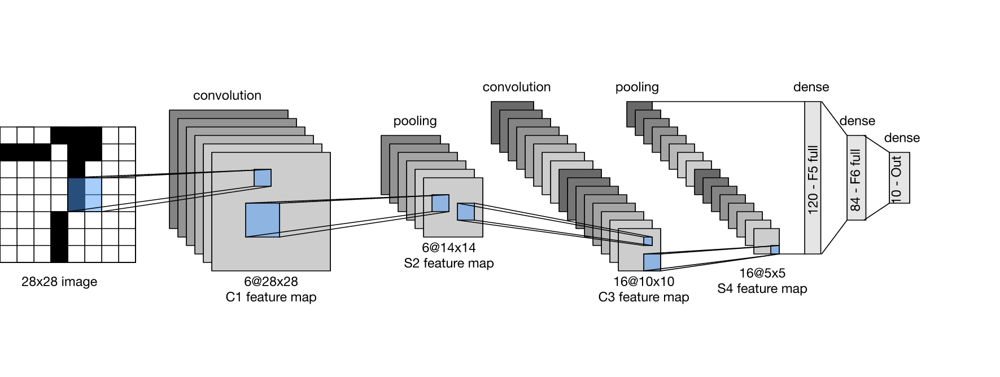

# SSN. Lab. 9. Splotowe sieci neuronowe

Zapoznaj się z zawartością notatnika Jupyter umieszczonego w repozytorium  i wykonaj zawarte w nim ćwiczenia.

Notatnik: [cnn.ipynb](https://github.com/IS-UMK/ssn_lab_09/blob/master/cnn.ipynb)
 

---

## Zad. 9. LeNet5 na MNIST

Zbuduj architekturę LeNet5 zgodnie z poniższą specyfikacją. Wytrenuj model klasyfikacji na danych MNIST. Postaraj się dobrać algorytm uczenia aby w 10 epokach uzyskać jak najwyższy poziom poprawności.  Oceń poprawność klasyfikacji uzyskanego modelu na zbiorze testowym. Przedstaw w formie graficznej wartości wag (filtrów) pierwszej warstwy splotowej C1. 

**Architektura LeNet5**

|     | Layer            | Kernels  | Kernel size   | Stride   | Pad   | Activation    | 
|-----|------------------|----------|---------------|----------|-------|---------------|
| C1  | Convolution      | 6        |  5x5          | 1        | 2  (``same``) | tanh  |
| S2  | Average  Pooling | -        |  2x2          | 2        | -             | -     |
| C3  | Convolution      | 16       |  5x5          | 1        | 0 (``valid``) | tanh  |
| S4  | Average  Pooling | -        |  2x2          | 2        | -             | -     |
| F1  | Fully connected  | 120      |  -            | -        | -             | tanh  |
| F2  | Fully connected  | 84       |  -            | -        | -             | tanh  |
| F3  | Fully connected  | 10       |  -            | -        | -             | softmax  |

Struktura sieci wraz z wynikowymi rozmiarami map cech przedstawia poniższy rysunek.

Rozwiązanie w postaci notatnika Jupyter (``.ipynb``) lub skrypt w języku Python (``.py``) umieść w repozytorium GitHub.

